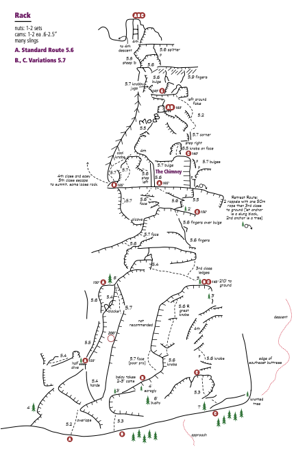

# Videos

If you want the video version of our adventure, here are the two
summary videos, each about 25 minutes long:

- [Cathedral Peak & Eichorn's Pinnacle (Part 1)](https://youtu.be/R2eLCRQG70I)
- [Cathedral Peak & Eichorn's Pinnacle (Part 2)](https://youtu.be/ig6kynUHPk0)

# Background

**Friday, July 16th, 2021** 

**Spoiler Alert**: The net/net is that after a lot of prepping and
climbing we succesfully got the following father/son photo from the
summit of Cathedral Peak! 

 

[Cathedral
Peak](https://www.google.com/search?q=cathedral+peak+yosemite&tbm=isch&ved=2ahUKEwiR--2RzYbyAhWDgZ4KHa5mCaQQ2-cCegQIABAA&oq=cathedral+peak+yosemite&gs_lcp=CgNpbWcQAzIECAAQQzICCAAyAggAMgQIABAYMgQIABAYUNoOWNoOYL4RaABwAHgAgAFMiAFMkgEBMZgBAKABAaoBC2d3cy13aXotaW1nwAEB&sclient=img&ei=yr0BYZHuH4OD-gSuzaWgCg&bih=931&biw=1440&rlz=1C5CHFA_enUS956US956)
is one of the most prominent and spectacular peaks near Tuolumne
Meadows in the portion of Yosemite that's north of Yosemite Valley.
John Muir made the first ascent of Cathedral Peak in 1869 by
scampering up the 4th class backside in boots.  The base of the peak
is around 10,200ft and it tops out at around 10,900ft.  The view from
the top is unsurpassed due to Cathedral's central location in
Yosemite.  The approach begins in Tuolumne Meadows at 8600ft and takes
about 2 hours.

*Cathedral on our hiking approach* 

 

*Cathedral climbing topo* 

 

Cathederal is well known among climbers due to its moderately rated
routes and beautiful white knobby granite.  The climbing routes go up
the southeast buttress and there are three "primary" variations, A, B,
and C, from left to right (although there are numerous variations in
between).  If climbed with a typical 60m rope (~185 feet), Cathedral
can be completed in 5
[pitches](https://en.wikipedia.org/wiki/Pitch_(ascent/descent)).  The
climbing is relatively sustained and diverse and increases in
difficulty and verticality as you ascend.

We climbed the lower portion of Cathedral between the A and B
variations and then went left and followed the B variation to the
summmit.

There are a couple notable features in the climb.  The first is the
chimney.  Climbing teams typically converge at the beginning of the
fourth pitch at the chimney which frequently becomes a choke point
serializing climbing teams.  The summit blocks are another notable
feature.  The last pitch has a nice crack at the top with a false
summit, followed by a (really is this the move?!) short down climb and
a step across a very exposed gully.  After that, there's a short ~20
foot 4th class scramble up onto two small summit blocks.  Last but not
least, the descent down the backside of Cathedral is somewhat
notorious (eg the death ledges).

If Cathedral is the main course, Eichorn's Pinnacle is the dessert.
Eichorn is one of the most breathtaking features in Tuolumne, named
after Jules Eichorn who was part of the first ascent party in 1931
(and another prominent early Yosemite climber).  It can be climbed on
its own right from its base, but after climbing Cathedral, it's only
about a 10 minute scramble over to Eichorn where there's a stellar,
airy, exposed, single pitch waiting.

*Eichorn photo from our Cathedral summit position (with Budd & Cathedral Lakes)* 

 

*Eichorn photo from Zeenat's position below the Cathedral summit* 

 

*Eichorn climbing topo* 

 

In the spring we began taking every opportunity we could to get Caden
out onto the rock with the thought of tackling a major Yosemite
objective like Royal Arches, Cathedral Peak, or Mount Tenaya.  We did
a lot of local rappelling and climbing at both Handley and Split Rock,
made multiple trips to Yosemite Valley where we did several shorter
multipitch routes, and we also made a camping/climbing trip to Joshua
Tree and got some rappelling and climbing in there.  The most
adventurous part of our prep and the overall adventure highlight was
taking Caden up the four pitches of [Tollhouse
Traverse](https://cdn2.apstatic.com/photos/climb/106090263_medium_1558646505.jpg)
in the Southern Sierras.  The summary of all that prep was that we
developed pretty high confidence that Caden had skills, endurance, and
maturity to tackle something like Cathedral Peak.  Eventually,
preparation met opportunity!

# Strategy

Here's a summary of our strategy:
- Climb on Friday to avoid the crowds
- Use a single 80m (8.5mm) rope, Jon leads, Caden ties in 30ft above me
- Travel light (cams double .3 to 2 with a single 3)
- Simulclimb if required the easier/lower pitches
- Finish early, and then knock out Eichorn's pinnacle
- Arrive back before dark!

# Approach

Zeenat, Caden, and I met Jon at 9:30am at the Cathedral Lakes
trailhead.  We sorted our gear, tossed on our harnesses and climbing
packs, and began the hike in.  It was a clear, picturesque, and
beautiful high Sierra day, that remained cloudless for the entire day.
It took us 2hrs 15mins to cover the 2.7 miles to get to the base of
the climb, and another 30 minutes or so to get ready to climb.  Caden
had a bit of altitude sickness over the course of the day so we slowed
our approach a bit so he could hydrate and slow his heart rate.

# Pitch 1 of 3

Jon began the first pitch at around 12:30, it was warm at the base, so
Caden and I both started with a single layer.  There was a party on
the A route, and several above, so Jon picked a line between the A and
B variations.  Caden and I began climbing around 10 minutes later, and
were simulclimbing with Jon (Jon continued leading as Caden and I
followed and cleaned the gear Jon had placed).  Jon built a belay
station on the 5.4 dihedral just above the top of the second pitches
for the A, B, and C routes (giving us a really long initial pitch of
around ~330 feet).

Caden loved this initial long pitch and climbed really well.  Here
were a few of his quotes from the first pitch:
- On learning what it's like to follow Jon: "There's no protection
  whatsoever."
- While waiting for Jon to build the anchor: "Awesome view I love it."
  and later "I love the view."
- Jon: "How do you like it so far?"  Caden: "I really like it, the
  view's super nice."
- "These Tuolumne knobs are littered all over."

*Caden at the base of the climb* 

 

*Climbing pitch 1* 

 

*Nearing the top of the first pitch* 

 

# Pitch 2 of 3

There were around 5 pairs of climbers at the chimney choke point so
Jon suggested we take the B route variation that goes up to the left
of the chimney and attempt to pass the the parties to increase our
odds of being able to climb Eichorn before dark (he'd free solo'ed the
pitch left of the chimney recently so he had a pretty good
recollection of what it was like).

Although the variation was a bit stiffer we opted for that option.
When Caden followed Jon's awesome lead, as the climbing difficulty
increased, Caden locked in and his climbing technique paralled the
difficulty, and he cruised through the two noticeable crux sections
with ease.

The belay station was towards the far left of the southeast buttress
and was relatively exposed.  For the most part, Caden used a hanging
belay technique as Jon led the 3rd pitch.  Caden was proving that not
only was he comfortable with the exposure, he actually was exhilarated
by it, and was soaking up the whole experience.  He was up around 500+
feet now and he was on cloud nine, loving the view, energized, and
feeling confident that he was going to be able to finish the route.
That belay station was a nice memory.

At this belay station we added a second layer for Caden due to the
cooler breeze, changed his GoPro battery, and drank a lot of water.
However, I made a mistake by not getting any carbs into his system at
this point.

*Climbing pitch 2, 5.7 face section & the 5.7 crux left of the chimney* 
 
 

# Climbing pitch 3 of 3

Although we'd passed several parties, there were still a couple above
us by the time Jon began the 3rd pitch but he passed them on his lead.

This top section is characterized by a lot of different shorter
sections of varied climbing.  It begins with a nice dihedral then a
series of ledges and short crack sections.  In one section Jon had
taken the 5.9 finger crack variation.  When Caden got there, he made
the attempt but the rope was pulling him to the left, so he got a bit
frustrated (I think he was low on energy), and eventually we bailed on
that variation and he took the middle 5.6 crack while I took the even
easier move left of that.

Above that, all that was left was the crack that led to the false
summit.  We had to wait in the crack behind a girl who took about ten
minutes to make the very last move at the top of the crack where it
gets a bit wide.  She and her partner had begun the route at 7:30am
and I think she was nearly completely exhausted!  Caden struggled in
the same spot briefly but pushed through and disappeared over the
false summit.

*Pitch 3 climbing, up the dihedral, and then Caden at the false summit* 
  
 

# Topping Out

Jon had built the belay station at the very base of the summit blocks
so I took the super short lead up the summit blocks (unnecessarily
placing one cam), built a belay station, and belayed Caden up (Jon
unroped and free solo'ed up to join us).  Caden's first words upon
reaching the summit block were "*I'm happy and I'm tired, there's
Eichorn!*" Caden and I had been looking at and discussing Eichorn for
a couple years, so although he was exhausted I think seeing Eichorn
gave him a boost of much needed adrenaline.

We had topped out after only 2 hours and 45 minutes of climbing.
Zeenat had hiked up the descent trail and was in a position on the
backside of Cathedral enabling us to see her and vice versa.  From her
perspective at the time it wasn't clear that we were even on the
summit!

*Climbing up the summit blocks* 

*On the summit with 360 degree views* 

*Zeenat's shot of us on the summit!* 

*Father/son summit shot!* 

# Traverse to Eichorn

After topping out, I lowered Caden from the summit block, Jon and I
down solo'ed, and we transitioned quickly off the route to the
backside of Cathedral.

There, we took a short break, Jon managed the rope, and I got Caden to
eat a bit and drink, but it was challenging, it was clear that he was
either dehydrated, bonked, had altitude sickness, or a combination of
all the above.  Normally we would have simply scampered across the
ledges to Eichorn, but due to his condition, we did a full 80m rap
down to a safer set of ledges and from there I short roped Caden to me
and we traversed carefully over to the base of Eichorn's Pinnacle
where Jon had established an anchor for our last pitch of the day.

*Caden rappelling from Cathedral in order to traverse to Eichorn* 

# Eichorn's Pinnacle

Now that we'd sat on Cathedral's summit block, this became the money
pitch, and it was a new one for both Caden and I.  I'd climbed
Cathedral previously but hadn't attempted to lead Eichorn's Pinnacle.
In my opinion it was the most complex and interesting pitch of the
day.  If you turn a C around backwards, and start at the bottom of the
C, traverse right, move up, then traverse left, that's the general
path that the pitch takes.

We changed our rope strategy for this pitch.  Once Jon got to the top
of Eichorn, I put Caden on a figure 8 on a bite at a point that was
probably 45 to 50 meters into the rope (quasi midpoint).  This would
allow Caden to get pretty close to the summit before I began climbing.
This strategy worked well with the 80 meter rope.

The first portion of the pitch is characterized by a traverse where
you are wrapping your way around the pinnacle and even down climbing a
bit with some immediate exposure as the pinnacle drops below your
feet for a few hundred feet.

Here's a video of me following on the pitch:

[Eichorn Lower Section of the Pitch (Shane Climbing) (no sound)](https://www.youtube.com/watch?v=GiWSj38ESbA&list=PLpuFCISxNROKfo3oChSUIj7XI6htmp7VG&index=28&t=169s)

In the video clip above, there's a spot 2:57 in, where I'd reached for
a hold and slipped and came extremely close to falling (closer than it
appears in the video).

The crux of the route is at the point when the initial traverse is
complete and the vertical ascent begins.  Jon and I used a couple high
left holds to get through this crux.  Caden said he found a little nob
to his right and did a pull to get up to it and a push on it to get up
farther to a much better hold beyond the crux.  This whole vertical
section of the pitch is sustained and has a lot of fun and varied
climbing.

At the top where you begin the traverse back towards the climbers
left, there are these huge dihedrals (unfortunately we didn't get
video of this section).  Visualize two columns, about a body width
apart, with the option of going to the left of the left column, the
right of the right column, or directly up between the two columns.
Climbers tend to go left (the route topo is marked with "exposed move
left").  Caden and I'd watched a couple videos preparing and he'd seen
the spot where he needed to go left so he was prepared!
Unfortunately, Jon went right!  I waited at the base for several
minutes as Jon explained to Caden how to get back on route and they
worked it out.  No climb is complete without some real time problem
solving.

When I climbed the pitch, I was also surprised when I got to
crossroads and noticed Jon had gone right.  The right side of the
right column was the opposite side of the pinnacle from where we'd
began the vertical ascent, and its exposure is pretty dramatic,
basically vertical, for a long ways, with a spectactular view.  I
really liked the "right" option!

At the summit it was clear Caden was really quite exhausted so we took
a couple photos and quickly descended.  I rappelled first, followed by
Caden, then Jon.  I then short roped myself to Caden and we made our
way back across the ledges and after about 20 minutes we got to the
other side where Zeenat was waiting for us.  We switched shoes, fueled
up, and began our hike back.

*Caden beginning the Eichorn traverse pitch* 

 

*Summit!  Cathedral Peak in the background from the Summit* 

 

*Eichorn summit and Caden rappelling* 

 

*Exhausted, Caden makes the traverse across the Cathedral ledges to the descent trail* 

*Tipping my cap to our trip leader!*

 

# Summary

[Full YouTube video playlist](https://www.youtube.com/playlist?list=PLpuFCISxNROJiCw14oRaawkyfC-O8rfh0)

Time:
- 9:30am - parked, geared up, 2 hour 15 minute approach (very slow pace)
- 12:30pm - started climbing
- 3:15pm - cathedral summit (2 hour 45 minutes of climbing)
- 4:50pm - began climbing eichorn
- 5:30pm - all on eichorn summit
- 6:30pm - begin return hike starting at the backside of cathedral
- 8:30pm - Returned to the trailhead (11 hours car to car)

Notes from the climb:
- Wearing in our harnesses on the hike in/out worked out well
- We needed all the water we took (3L for Caden and I during the climb plus a couple liters on the approach)
- The more high altitude acclimation we can do prior, the better (Caden suffered from some altitude sickness during the adventure)
- GoPro batteries and SD card size: next time around I'd take two GoPro 9s, and use two 256GB microSD cards.  I ended up swapping micro SDs on the summit block (crazy)!  I'd also switch batteries every two pitches or so just to make sure I didn't miss any action.
- Going light on the cams worked well

And repeating some notes from the last time we climbed:
- Consider taking more water then what you think you'll need, leave extra at the base for the return, drink a lot over the first three pitches.
- There aren't many picnic ledges, so the food you eat on the route needs to be easily accessible and quickly consumable.
- Don't forget sunscreen & sunglasses!
